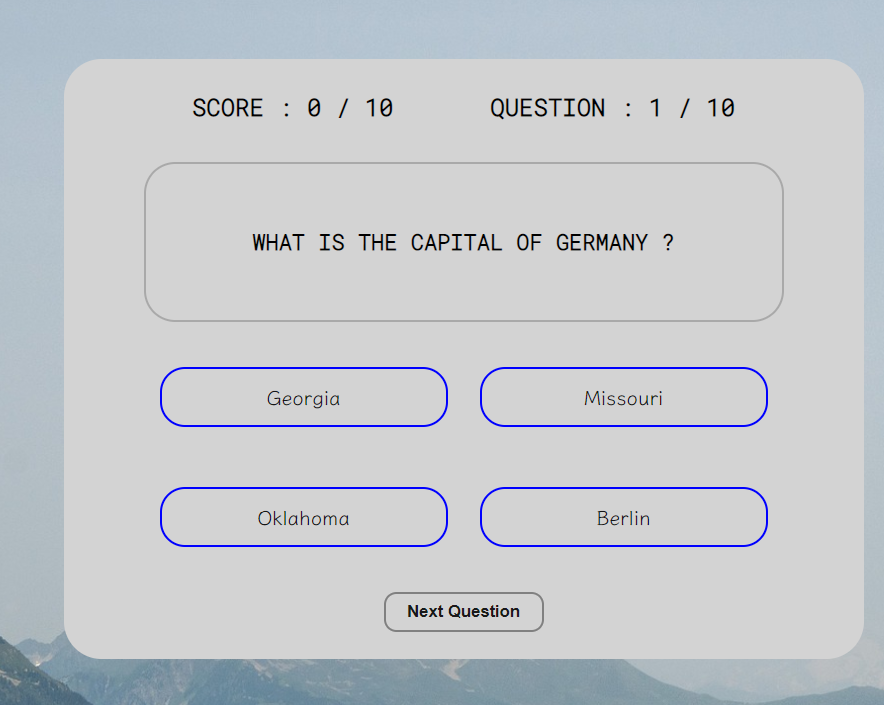
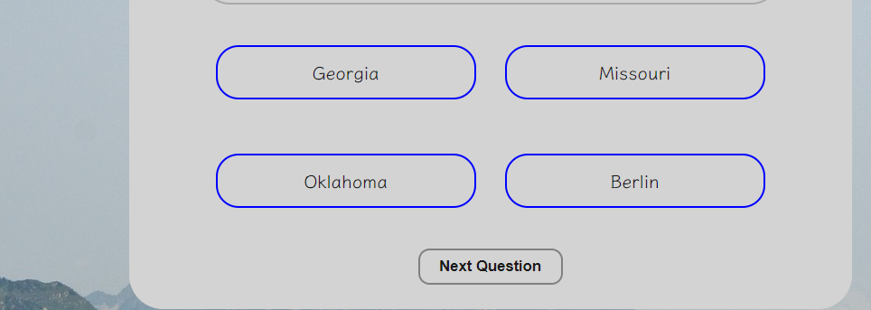
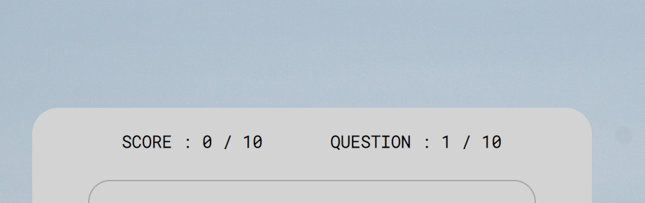

# QUIZIT

QuizIT is a website that offer trivia on important sport and geographical issues.The project is design to help all user old and young be up to date about all things sport.It gives a real time Answer to each question.

The QuizIT website also shows how JavaScript works in a real-world context.The site is targetted toward everyone who is inquisitive and looking for a challenge.QuizIT is a fully responsive website .

[View the live project here.](https://diddyjax19.github.io/QuizIT/index.html)

Responsive on all device sizes
        Link [View](http://www.responsinator.com/?url=https%3A%2F%2Fdiddyjax19.github.io%2FQuizIT%2Findex.html)

### Existing Features

- __The QUIZIT Heading__

  - Featured at the top of the page, the QuizIT heading is easy to see for the user. Upon viewing the page, the user will be able to see the name of the game and even if he goes to anothe page can easily come back to the game area.

- __The Quiz Area__

- The QuizIT game can be played in this area. The user will find it simple to read the questions and choose the appropriate response from the choices A to D.

- __The Option section__

  - - When the user chooses an option, he or she will will be able to see their response. If it is incorrect, the response will be highlighted in red, and if it is correct, it will be highlighted in green.

- __The Score Area__

  -  At the top of the screen, the user can also see how many questions they have answered and how many of them were correct.

 __The SignUp section__

  - In this area,you can register by adding an Email address and creating your password.

  

  __The Footer section__

  - In this area,you can click the link and be directed to either the facebook,instagran,twitter and you-tube page.

  

  __The Quick-link section__

  - In this area,at the side of the screen you can see the quick link,that if clicked can go the home page and the sign-up page.

  

### Validator Testing 

- HTML
    - No errors were returned when passing through the official [W3C validator](https://validator.w3.org/nu/?doc=https%3A%2F%2Fcode-institute-org.github.io%2Flove-maths%2F)

- CSS
    - No errors were found when passing through the official [(Jigsaw) validator](https://jigsaw.w3.org/css-validator/validator?uri=https%3A%2F%2Fdiddyjax19.github.io%2FQuizIT%2F&profile=css3svg&usermedium=all&warning=1&vextwarning=&lang=en)
- JavaScript
    - No errors were found when passing through the official [Jshint validator](https://jshint.com/)
      - The following metrics were returned: 
      - There are 15 functions in this file.
      - Function with the largest signature take 1 arguments, while the median is 0.
      - Largest function has 16 statements in it, while the median is 3.
      - The most complex function has a cyclomatic complexity value of 9 while the median is 1.

      - Accessibility
    - I confirmed that the colors and Fonts chosen are easy to read and accessible by running it through Lighthouse in Devtools
    <h2 align="center"></h2>

    
### Further Testing

-   The Website was tested on Google Chrome, Internet Explorer, Microsoft Edge and Safari browsers.
-   The website was viewed on a variety of devices such as Desktop, Laptop, iPhone7, iPhone 8 & iPhoneX.
-   A large amount of testing was done to ensure that all pages were linking correctly.
-   Friends and family members were asked to review the site and documentation to point out any bugs and/or user experience issues.

## Deployment

This section should describe the process you went through to deploy the project to a hosting platform (e.g. GitHub) 

- The site was deployed to GitHub pages. The steps to deploy are as follows: 
  - In the GitHub repository, navigate to the Settings tab 
  - From the source section drop-down menu, select the Master Branch
  - Once the master branch has been selected, the page will be automatically refreshed with a detailed ribbon display to indicate the successful deployment. 

The live link can be found here - https://diddyjax19.github.io/QuizIT/
### Content 

- The two main colours used are In Yoga Websites are Black,Grey,dogerblue,blue,green-cyan,cyan-blue and white.

- [Font Awesome](https://fontawesome.com/)
    - The icons in the footer were taken from 
- [Google Font](https://fonts.google.com/)
    - The Fonts in this website are gotten from google font 
- [Git](https://git-scm.com/)
    - Git was used for version control by utilizing the Gitpod terminal to commit to Git and Push to GitHub.
- [GitHub:](https://github.com/)
    - GitHub is used to store the projects code after being pushed from Git.
### Media

- The photos used on the home and sign up page are from This Open Source site [PixaBay](https://pixabay.com/).

## Other General Project Advice

- Below you will find a couple of extra tips that may be helpful when completing your project. Remember that each of these projects will become part of your final portfolio so it’s important to allow enough time to showcase your best work! 

- One of the most basic elements of keeping a healthy commit history is with the commit message. When getting started with your project, read through [this article](https://chris.beams.io/posts/git-commit/) by Chris Beams on How to Write  a Git Commit Message 
  - Make sure to keep the messages in the imperative mood 

- When naming the files in your project directory, make sure to consider meaningful naming of files, point to specific names and sections of content.
  - For example, instead of naming an image used ‘image1.png’ consider naming it ‘landing_page_img.png’. This will ensure that there are clear file paths kept. 

- Do some extra research on good and bad coding practices, there are a handful of useful articles to read, consider reviewing the following list when getting started:
  - [Writing Your Best Code](https://learn.shayhowe.com/html-css/writing-your-best-code/)
  - [HTML & CSS Coding Best Practices](https://medium.com/@inceptiondj.info/html-css-coding-best-practice-fadb9870a00f)
  - [Google HTML/CSS Style Guide](https://google.github.io/styleguide/htmlcssguide.html#General)

Getting started with your Portfolio Projects can be daunting, planning your project can make it a lot easier to tackle, take small steps to reach the final outcome and enjoy the process! 

### Acknowledgements

-   My Mentor for continuous helpful feedback.

-   Tutor support at Code Institute for their support.

- 