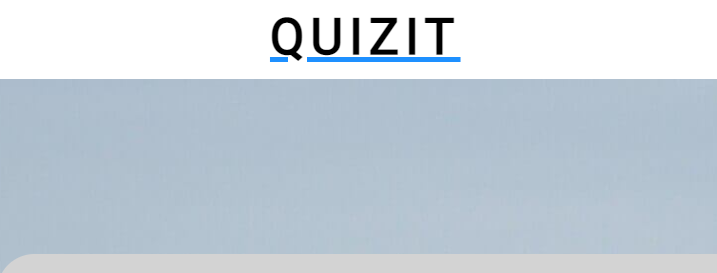
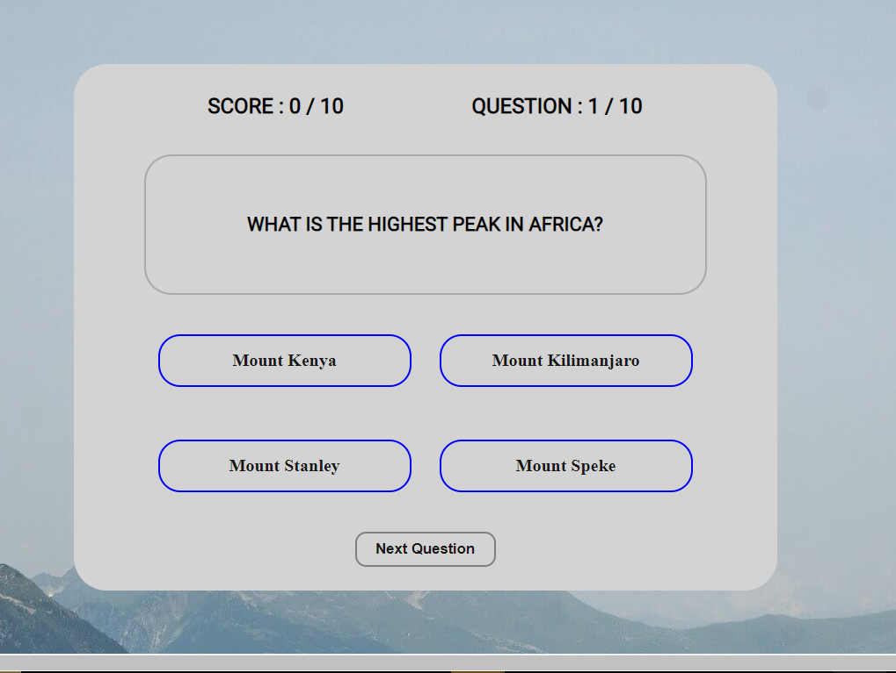
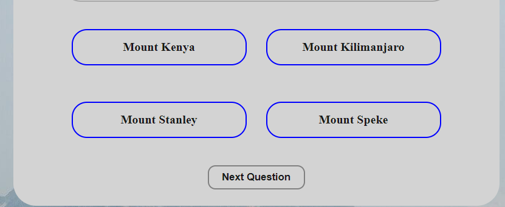
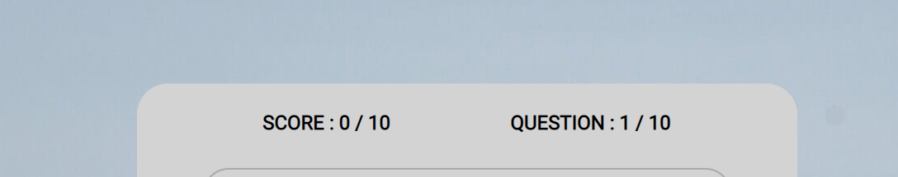
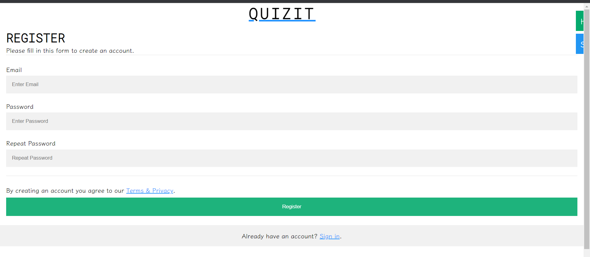
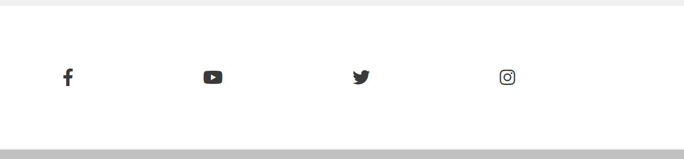
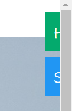

# QUIZIT

QuizIT is a website that offer trivia on important sport and geographical issues.The project is design to help all user old and young be up to date about all things sport.It gives a real time Answer to each question.

The QuizIT website also shows how JavaScript works in a real-world context.The site is targetted toward everyone who is inquisitive and looking for a challenge.QuizIT is a fully responsive website .

[View the live project here.](https://diddyjax19.github.io/QuizIT/index.html)

Responsive on all device sizes
        Link [View](http://www.responsinator.com/?url=https%3A%2F%2Fdiddyjax19.github.io%2FQuizIT%2Findex.html)

# User Experience (UX)

  - User stories

    - First Time Visitor Goals

      a. As a First Time Visitor, I want to easily understand the main purpose of the site and learn more about the organisation.
      b. As a First Time Visitor, I want to be able to easily navigate throughout the site to find content.
      c.As a First Time Visitor, I want to look for testimonials to understand what their users think of them and see if they are trusted. I also want to locate their social media links to see their followings on social media to determine how trusted and known they are.

    - Returning Visitor Goals.

      a. As a Returning Visitor, I want to find information about coding challenges.
      b. As a Returning Visitor, I want to find the best way to get in contact with the organisation with any questions I may have.
      c. As a Returning Visitor, I want to find community links.

    - Frequent User Goals.

      a. As a Frequent User, I want to check to see if there are any newly added challenges or hackathons.
      b. As a Frequent User, I want to check to see if there are any new blog posts.
      c. As a Frequent User, I want to sign up to creat an account.

### Existing Features

- __The QUIZIT Heading__

  - Featured at the top of the page, the QuizIT heading is easy to see for the user. Upon viewing the page, the user will be able to see the name of the game and even if he goes to anothe page can easily come back to the game area.

- __The Quiz Area__

- The QuizIT game can be played in this area. The user will find it simple to read the questions and choose the appropriate response from the choices A to D.

- __The Option section__

  - - When the user chooses an option, he or she will will be able to see their response. If it is incorrect, the response will be highlighted in red, and if it is correct, it will be highlighted in green.

- __The Score Area__

  -  At the top of the screen, the user can also see how many questions they have answered and how many of them were correct.

 __The SignUp section__

  - In this area,you can register by adding an Email address and creating your password.

  

  __The Footer section__

  - In this area,you can click the link and be directed to either the facebook,instagran,twitter and you-tube page.

  

  __The Quick-link section__

  - In this area,at the side of the screen you can see the quick link,that if clicked can go the home page and the sign-up page.

  

### Validator Testing 

- HTML
    - No errors were returned when passing through the official 
        [W3C validator][Home Page](https://validator.w3.org/nu/?doc=https%3A%2F%2Fdiddyjax19.github.io%2FQuizIT%2F)
        [W3C validator][SignUp Page](https://validator.w3.org/nu/?doc=https%3A%2F%2Fdiddyjax19.github.io%2FQuizIT%2Fform.html)

- CSS
    - No errors were found when passing through the official 
        [(Jigsaw) validator][Home Page](https://jigsaw.w3.org/css-validator/validator?uri=https%3A%2F%2Fdiddyjax19.github.io%2FQuizIT%2Findex.html&profile=css3svg&usermedium=all&warning=1&vextwarning=&lang=en)
        [(Jigsaw) validator][SignUp Page](https://jigsaw.w3.org/css-validator/validator?uri=https%3A%2F%2Fdiddyjax19.github.io%2FQuizIT%2Fform.html&profile=css3svg&usermedium=all&warning=1&vextwarning=&lang=en)

      
- JavaScript
    - No errors were found when passing through the official [Jshint validator](https://jshint.com/)
      - The following metrics were returned: 
      - There are 15 functions in this file.
      - Function with the largest signature take 1 arguments, while the median is 0.
      - Largest function has 16 statements in it, while the median is 3.
      - The most complex function has a cyclomatic complexity value of 9 while the median is 1.

      - Accessibility
    - I confirmed that the colors and Fonts chosen are easy to read and accessible by running it through Lighthouse in Devtools
    <h2 align="center"></h2>    
### Further Testing

-   The Website was tested on Google Chrome, Internet Explorer, Microsoft Edge and Safari browsers.
-   The website was viewed on a variety of devices such as Desktop, Laptop, iPhone7, iPhone 8 & iPhoneX.
-   A large amount of testing was done to ensure that all pages were linking correctly.
-   Friends and family members were asked to review the site and documentation to point out any bugs and/or user experience issues.

### Testing User Stories from User Experience (UX) Section

-   #### First Time Visitor Goals

    1. As a First Time Visitor, I want to easily understand the main purpose of the site and learn more about the organisation.

        1. Upon entering the site, users are automatically greeted with a clean and easily readable navigation bar to go to the page of their choice.
        2. The user has two options
          a. Scroll down and start and start answering the questions.
          b. Click the side bar and sign-up to be registered.

    2. As a First Time Visitor, I want to be able to easily be able to navigate throughout the site to find content.

        1. The site has been designed to be fluid and never to entrap the user. At the top of each page there is a clean navigation bar, each link describes what the page they will end up at clearly.
        2. At the bottom of the first pages there is a redirection call to action to ensure the user always has somewhere to go and doesn't feel trapped as they get to the bottom of the page.
        3. On the Signup Page, after a form response is submitted, the page refreshes and the user is brought to the top of the page where the navigation bar is.

    3. As a First Time Visitor, I want to look for testimonials to understand what their users think of them and see if they are trusted. I also want to locate their social media links to see their following on social media to determine how trusted and known they are.
        1. Once the new visitor visit the page he can immediately start the fun quiz,it is not a must to creat an account.
        2. The user can also scroll to the bottom of any page on the site to locate social media links in the footer.
        3. At the bottom of the Contact Us page, the user is told underneath the form, that alternatively they can contact the organisation on social media which highlights the links to them.

-   #### Returning Visitor Goals

    1. As a Returning Visitor, I want to find the new programming challenges or hackathons.

        1. These are clearly shown in the banner message.
        2. They will be directed to a page with another hero image and call to action.

    2. As a Returning Visitor, I want to find the best way to get in contact with the organisation with any questions I may have.

        1. The navigation bar clearly highlights the "SignUp" Page.
        2. Here they can fill out the form on the page or are told that alternatively they can message the organisation on social media.
        3. The footer contains links to the organisations Facebook, Twitter and Instagram page as well as the organization's email.
        4. Whichever link they click, it will be open up in a new tab to ensure the user can easily get back to the website.
        5. The email button is set up to automatically open up your email app and autofill there email address in the "To" section.

    3. As a Returning Visitor, I want to find the Facebook Group link so that I can join and interact with others in the community.
        1. The Facebook Page can be found at the footer of every page and will open a new tab for the user and more information can be found on the Facebook page.
        2. Alternatively, the user can scroll to the bottom of the Home page to find the Facebook Group redirect card and can easily join by clicking the "Join Now!" button which like any external link, will open in a new tab to ensure they can get back to the website easily.
        3. If the user is on the "Our Favourites" page they will also be greeted with a call to action button to invite the user to the Facebook group. The user is incentivized as they are told there is a weekly favourite product posted in the group.

-   #### Frequent User Goals

    1. As a Frequent User, I want to check to see if there are any newly added challenges or hackathons.

        1. The user would already be comfortable with the website layout and can easily click the banner message.

    2. As a Frequent User, I want to check to see if there are any new blog posts.

        1. The user would already be comfortable with the website layout and can easily click the blog link

    3. As a Frequent User, I want to sign up to the Newsletter so that I am emailed any major updates and/or changes to the website or organisation.
        1. At the bottom of every page their is a footer which content is consistent throughout all pages.
  
- Known Bugs

  - All bugs resolved.

## Deployment

1. Log in to GitHub and locate the [GitHub Repository](https://github.com/)
2. At the top of the Repository (not top of page), locate the "Settings" Button on the menu.
    - Alternatively Click [Here](https://github.com/diddyjax19/QuizIT/blob/f5d93ada8d9f809d1c60643bf87808d4bd9d0aca/index.html) for a GIF demonstrating the process starting from Step 2.
3. Scroll down the Settings page until you locate the "GitHub Pages" Section.
4. Under "Source", click the dropdown called "None" and select "Main".
5. The page will automatically refresh.
6. Scroll back down through the page to locate the now published site [link](https://diddyjax19.github.io/QuizIT/) in the "GitHub Pages" section.

The live link can be found here - https://diddyjax19.github.io/QuizIT/
### Credit 

- Content
    - The Qestions for the Home page was taken from https://www.cosmopolitan.com/
    - Instructions on how to implement form validation on the Sign Up page was taken from w3schools.
    - Content The code used to make the footers in all the files where gotten from love running project.
    - Content The code used to make the body in all the files where gotten from love math project.
    

#### Colour Scheme

    - The colours used are In QuizIT Websites are Black,Grey,dogerblue,blue,green-cyan,cyan-blue and white.
    - In order to pick the background and text color i used the color grid  tool [Color Grid](https://contrast-grid.eightshapes.com//HTML5) . This provide appropriate information to make a better decision when choosing my colors.

   #### Typography
   -   The Roboto font is the main font used throughout the whole website with Sans Serif as the fallback font in case for any reason the font isn't being imported into the site correctly. 

- [Font Awesome](https://fontawesome.com/)
    - The icons in the footer were taken from 
- [Google Font](https://fonts.google.com/)
    - The Fonts in this website are gotten from google font 
- [Git](https://git-scm.com/)
    - Git was used for version control by utilizing the Gitpod terminal to commit to Git and Push to GitHub.
- [GitHub:](https://github.com/)
    - GitHub is used to store the projects code after being pushed from Git.
### Media

- The photos used on the home and sign up page are from This Open Source site [PixaBay](https://pixabay.com/).

- Make your website faster and save bandwidth. TinyPNG optimizes your WebP, PNG and JPEG images by 50-80% while preserving full transparency! [TinyPng post](https://tinypng.com/)

### Languages Used

- [HTML5](https://en.wikipedia.org/wiki/HTML5)
- [CSS3](https://en.wikipedia.org/wiki/Cascading_Style_Sheets)
- [JavaScript](https://en.wikipedia.org/wiki/JavaScript)

### Acknowledgements

- My Mentor for continuous helpful feedback.

- Tutor support at Code Institute for their support.

